+++
title = "Rubik's Cube Algorithms"
date = "2025-09-06"
toc = false
+++

# Algorithms

## 2 Look OLL
Orient Last Layer

### Edge Orientation
| Name | Image |  Algorithm |
|:----:|:-----:|:----------:|
| Opposite | 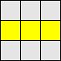 | __F (R U R' U') F'__ |
| Adjacent | 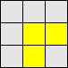 | __f (R U R' U') f'__ |
| None | 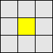 | __F (R U R' U') F' f (R U R' U') f'__ |

### Corner Orientation
| Name | Image |  Algorithm |
|:----:|:-----:|:----------:|
| Sune | 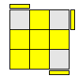 | __R U R' U R U2 R'__ |
| Anti-Sune | 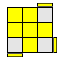 | __R' U' R U' R' U2 R__ |
| Car 🚗 | 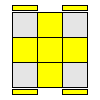 | __F (R U R' U')*3 F'__ |
| Blinker 🚨 | 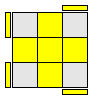 | __R U2 R2 U' R2 U' R2 U2 R__ |
| Headlights | 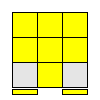 | __R2 D R' U2 R D' R' U2 R'__ |
| Chameleon 🐸 | 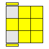 | __r U R' U' r' F R F'__ |
| Bowtie 🎀 | 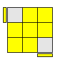 | __F' r U R' U' r' F R__ |

## 2 Look PLL
Permute Last Layer

### Corner Permutation
| Name | Image | Algorithm |
|:----:|:-----:|:---------:|
| CW Corner 3-Cycle | 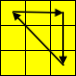 | __x R' U R' D2 R U' R' D2 R2__ |
| E-Perm            | 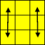 | __x' R U' R' D R U R' u2 R' U R D R' U' R__ |

### Edge Permutation
| Name | Image | Algorithm |
|:----:|:-----:|:---------:|
| CW Edge 3-Cycle | 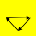 | __R2 U R U R' U' R' U' R' U R'__ |
| CCW Edge 3-Cycle | 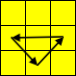 | __R U' R U R U R U' R' U' R2__ |
| H-Perm |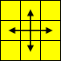 | __M2 U M2 U2 M2 U M2__ |
| Z-Perm | 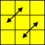 | __M2 U M2 U M' U2 M2 U2 M' U2__ |

## Blindfold
[cubefreak.net/bld/3op_guide.php](https://cubefreak.net/bld/3op_guide.php)

| Name | Image | Algorithm | Inverse |
|:----:|:-----:|:---------:|:-------:|
| Edge Orientation | 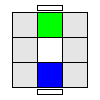 | {{ rubiks(text="__M' U M' U M' U2 M U M U M U2__", alg="M-UM-UM-U2MUMUMU2") }} |
| Corner Orientation Pair | 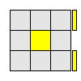 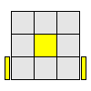 | __R' D' R D R' D' R__ | __R' D R D' R' D R__ |
| Corner Orientation Triple | 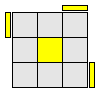 | __(R' D' R D)*2__ | __(R' D R D')*2__ |
| Corner 3-Cycle |  | __x R' U R' D2 R U' R' D2 R2__ |
| CCW Corner 3-Cycle | 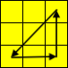 | __R B' R F2 R' B R F2 R2__ |
| Edge 3-Cycle |  | __R2 U R U R' U' R' U' R' U R'__ | __R U' R U R U R U' R' U' R2__ |

## Pocket Cube (2x2)
| Name | Image | Algorithm | Inverse |
|:----:|:-----:|:---------:|:-------:|
| Corner T-Perm | 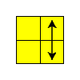 | {{ rubiks(text="__(R U R' U') (R' F) (R2 U') (R' U' R U) (R' F')__", puzzle="2x2x2", alg="(R_U_R-_U-)_(R-_F)_(R2_U-)_(R-_U-_R_U)_(R-_F-)", setup="F_R_U-_R-_U_R_U_R2_F-_R_U_R_U-_R-") }} |

## Rubik's Cube Revenge (4x4)
[rubiksplace.com/cubes/4x4/](https://rubiksplace.com/cubes/4x4/)

| Name | Image | Algorithm |
|:----:|:-----:|:---------:|
| Edge Merge | 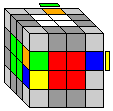 | {{ rubiks(text="__d R U R' d'__", puzzle="4x4x4", alg="dRUR-d-", setup="y") }} |
| Anti-Edge Merge | 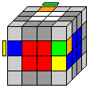 | {{ rubiks(text="__d' L' U' L d__", puzzle="4x4x4", alg="d-L-U-Ld", setup="y") }} |
| Double Edge Merge | 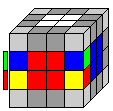 | {{ rubiks(text="__d R F' U R' F d'__", puzzle="4x4x4", alg="dRF-UR-Fd-", setup="y") }} |
| OLL Parity | 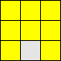 | {{ rubiks(text="__r U2 x r U2 r U2 r' U2 l U2 r' U2 r U2 r' U2 r'__", puzzle="4x4x4", alg="r_U2_x_r_U2_r_U2_r-_U2_l_U2_r-_U2_r_U2_r-_U2_r-", setup="xx") }} |
| PLL Parity | 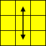 | {{ rubiks(text="__2R2 U2 2R2 u2 2R2 2U2__", puzzle="4x4x4", alg="2R2_U2_2R2_u2_2R2_2U2", setup="xx") }} |

# Notation
[rubiksplace.com/move-notations/](https://rubiksplace.com/move-notations/)

## Faces
* __F__ 👉 Front
* __R__ 👉 Right
* __B__ 👉 Back
* __L__ 👉 Left
* __U__ 👉 Top (Up)
* __D__ 👉 Bottom (Down)

## Middle Layers
* __M__ 👉 Slice between __L__ & __R__ (Middle)
* __E__ 👉 Slice between __U__ & __D__ (Equator)
* __S__ 👉 Slice between __F__ & __B__ (Side)

## Cube Rotations
* __x__ 👉 Rotate about __R__ face
* __y__ 👉 Rotate about __U__ face
* __z__ 👉 Rotate about __F__ face

A single letter implies a __clockwise__ turn of 90 degrees when viewed directly at the face. If it's followed by a prime, then it implies a __counter-clockwise__ turn. It it's followed by a __2__, then it implies a __half__ turn of 180 degrees.

A lowercase letter means you need to turn two layers of the corresponding face.

With the Rubik's Cube Revenge, a __2__ in front of a letter means you only turn the inner layer of that face.

## Examples
* __F2__ 👉 Turn front face twice
* __D' R__ 👉 Turn bottom face counter-clockwise, then the right face clockwise
* __x M R2__ 👉 Turn cube so top face is towards you, then rotate the middle slice clockwise and the right face twice
